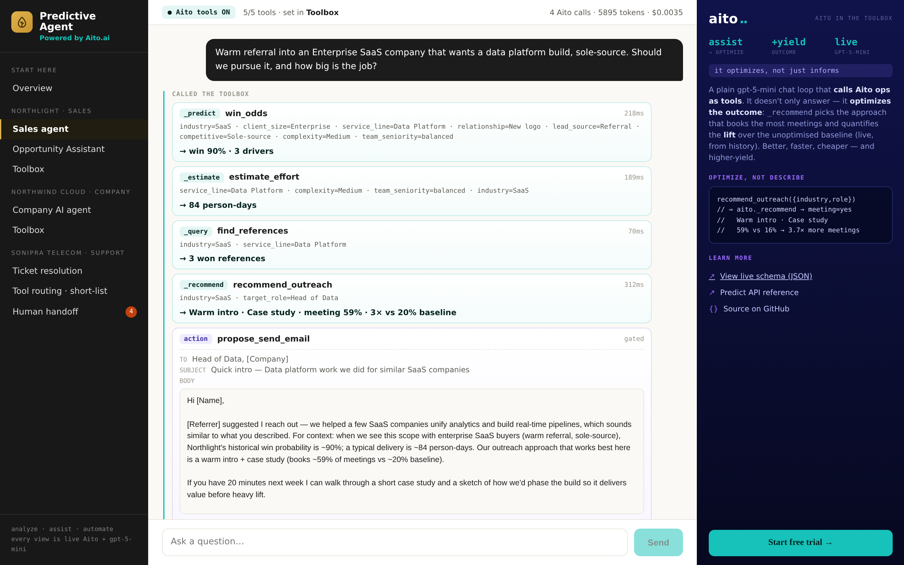
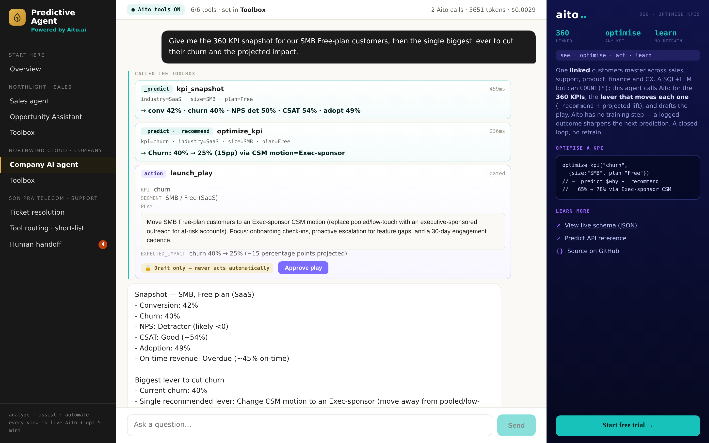

# Predictive Agent — Aito as the intuition in an LLM agent's toolbox

> A working reference implementation showing [Aito.ai](https://aito.ai) as
> the **predictive layer an LLM agent calls as a tool**. One live
> `gpt-5-mini` agent reasons; when it needs a number it can't invent —
> win odds, effort, the outreach that books the most meetings, the lever
> that moves a KPI — it calls an Aito op over the company's own history
> and gets a calibrated answer with a `$why`. No model training. No
> retraining. Add a row, the next prediction reflects it.

[](https://aito.ai)
[](https://agent.aito.ai)
[](https://demos.aito.ai)

Live at **[agent.aito.ai](https://agent.aito.ai)**. Companion to the other
Aito reference demos ([accounting](https://accounting.aito.ai),
[erp](https://erp.aito.ai), [ecommerce](https://ecommerce.aito.ai)) — those
embed predictions in a product UI; this one puts the **five Aito ops** in
an LLM agent's hands and shows what changes when you flip them off.



## The one idea

LLMs gave an agent **reasoning**. RAG gave it **memory**. Neither gives it
**intuition** — the calibrated, learned-from-your-data "I've seen this
before, here's what usually happens." A neural net has that intuition but
is frozen at training time and about the whole world, not your business.

**Aito is that intuition as a query.** The same act as a neural net —
turn rows into an instant, calibrated answer — but live, over *your*
tables, with nothing to train. Five operators cover it:

| Op | Returns | In this demo |
|----|---------|--------------|
| `_predict` | a class + calibrated `$p` + `$why` | win odds, ticket intent, KPI rates, tool short-list |
| `_estimate` | a number | engagement effort (person-days), expected MRR |
| `_recommend` | the action that maximises an outcome | the outreach / lever that books meetings, cuts churn |
| `_relate` | drivers / lift (with `$on` to scope a segment) | the root causes behind a KPI, within a segment |
| `_match` | the relevant memory | reference engagements, similar tickets |

Every surface in the app is a real call to one of these against a live
Aito instance — latency and cost in the UI are measured, not mocked.

## Try it instantly (no signup)

The demo's Aito instance is public **read-only**. Predict the win odds of
a consulting opportunity straight from history:

```bash
curl -X POST https://shared.aito.ai/db/aito-agent-demo/api/v1/_predict \
  -H "x-api-key: 08b98adef5a80260a41273d5efb9e050fc24cef3dece1eb725c675b4bb1dd5a8" \
  -H "Content-Type: application/json" \
  -d '{
    "from": "engagements",
    "where": {
      "client_industry": "SaaS",
      "service_line": "Data Platform",
      "deal_size_band": "L",
      "lead_source": "Referral",
      "relationship": "Existing client"
    },
    "predict": "outcome",
    "select": ["$p", "feature", "$why"]
  }'
```

Change `lead_source` to `"Cold outbound"` and the probability drops — the
history is what conditions it. Now ask which outreach **books a meeting**
for that buyer (an `_recommend`, the op that optimises rather than
describes):

```bash
curl -X POST https://shared.aito.ai/db/aito-agent-demo/api/v1/_recommend \
  -H "x-api-key: 08b98adef5a80260a41273d5efb9e050fc24cef3dece1eb725c675b4bb1dd5a8" \
  -H "Content-Type: application/json" \
  -d '{
    "from": "outreach",
    "where": { "target_industry": "SaaS", "target_role": "Head of Data" },
    "recommend": "angle",
    "goal": { "meeting": "yes" },
    "limit": 3
  }'
```

## What's in the demo

Three fictional companies, one shell, every surface in the left menu. Each
domain shows the same thesis from a different angle.

### 1 · Northlight — a consulting firm (`Sales`)

Tables: **`engagements`** (1,800 past deals) · **`outreach`** (2,200 sends).

| Surface | What it does | Ops |
|---------|--------------|-----|
| **Opportunity Assistant** | A deal-sheet dashboard: win odds + `$why`, effort in person-days, three reference engagements, and the best way in — the four numbers an LLM can't invent, called *directly*. | `_predict` · `_estimate` · `_query` · `_recommend` |
| **Sales agent** | The same numbers, but the model calls them as **tools** in a chat. It doesn't just answer — it optimises the outcome and quantifies the lift over the unoptimised baseline. | agent → 4 Aito tools + 1 gated action |
| **Toolbox** | Flip the Aito tools off and ask again: the agent has to **guess**, and it tells you it's guessing. The augment thesis, A/B in one switch. | toggle |

→ [docs/use-cases/01-opportunity-assistant.md](docs/use-cases/01-opportunity-assistant.md) ·
[02-sales-agent.md](docs/use-cases/02-sales-agent.md)

### 2 · Northwind Cloud — a SaaS company (`Company`)

A **360° linked model**: one `customers` master (1,500) joined to
`deals`, `tickets`, `feedback`, `usage` and `invoices`. Conditioning a
child table on `customer.size` traverses the link — no join to write.

| Surface | What it does | Ops |
|---------|--------------|-----|
| **360 Dashboard** | Pick a segment → six KPIs (conversion, churn, NPS, CSAT, adoption, on-time), each with its **root causes** (`_relate` scoped to the segment with `$on`), the **lever that moves it** (`_recommend` + projected lift), and a `$why` behind every number. | `_predict` · `_relate $on` · `_recommend` |
| **Company AI agent** | Ask the company's own numbers in a chat; the agent calls the KPI, the lever, the per-customer 360 join, and an MRR estimate. A BI bot can `COUNT(*)`; this one optimises. | agent → 5 Aito tools + 1 gated play |
| **Toolbox** | Same on/off switch — the agent falls back to flagged guesses without the Aito ops. | toggle |

→ [docs/use-cases/03-company-360-dashboard.md](docs/use-cases/03-company-360-dashboard.md) ·
[04-company-agent.md](docs/use-cases/04-company-agent.md)



### 3 · Sonipra Telecom — support operations (`Support`)

Tables: **`resolutions`** (4,000 resolved tickets) · **`tool_calls`** (a
240-tool catalog with the right pick per ticket).

| Surface | What it does | Ops |
|---------|--------------|-----|
| **Ticket resolution** | The same ticket resolved two ways, side by side: a live `gpt-5-mini` call (seconds, tokens) vs. two `_predict` calls (sub-second, $0, with a calibrated `$why`). The response-rate gap, live. | `_predict` ×2 vs LLM |
| **Tool routing · short-list** | `_predict` narrows the 240-tool catalog to the ~5 that fit, so the LLM picks from 5 not 240 — smaller prompt, same answer, ~16× fewer tokens. Aito *augments* the LLM, it doesn't replace it. | `_predict` short-list |
| **Human handoff** | Calibrated confidence as **governance**: `$p ≥ .85` auto-resolves, a borderline read is handed to a human, and anything sensitive (refund, cancel) is gated regardless. The number decides who acts. | `_predict` `$p` gate |

→ [docs/use-cases/05-ticket-resolution.md](docs/use-cases/05-ticket-resolution.md) ·
[06-tool-routing-and-handoff.md](docs/use-cases/06-tool-routing-and-handoff.md)

**Full use-case library: [docs/use-cases/](docs/use-cases/)** — one
document per surface, each with the exact Aito query, how the UI renders
it, and what's deliberately out of scope.

## Architecture

```
browser ── /api/* ──▶ FastAPI (src/app.py) ──▶ Aito  (predictions)
                              │
                              └──────────────▶ Azure OpenAI gpt-5-mini  (the agent)
```

- **Backend** — Python 3.12 + FastAPI + uvicorn. One process serves both
  `/api/*` and the static frontend. Every Aito call goes through the shared
  `AitoClient` (`src/aito_client.py`), which records the last call's op +
  latency so the topbar's latency badge stays honest. The agent loop lives
  in `src/agent_core.py`; per-agent tool sets in `src/sales_agent.py` /
  `src/company_agent.py`.
- **Frontend** — Next.js 16 static export (`frontend/out/`). The whole demo
  is one client shell (`frontend/components/AppShell.tsx`) — left nav,
  centre view, right Aito context panel — so navigation never unmounts.
- **Data backend** — Aito only. No other database. The three domains share
  one Aito instance; tables are seeded by `scripts/seed_*.py`.
- **The agent is live and rate-limited** — the chat + resolution surfaces
  make real `gpt-5-mini` calls, capped per-IP so the public demo can't run
  up a bill. Aito calls are free and unmetered.

## Local dev

```bash
./do install    # uv sync + npm install (one-time)
./do dev        # next dev on :4100 + uvicorn on :4101, hot-reload both
./do build      # production-shape static export → frontend/out/
./do test-book  # booktest snapshot suite
```

Copy `.env.example` to `.env` — it ships with the public read-only Aito
key, so predictions work out of the box. For the live agent surfaces you
need Azure OpenAI creds (`OPENAI_MODEL_*`); without them the predictive
surfaces still work and the chat reports the agent as unavailable.

Re-seed the Aito instance (needs a write key, not the public one):

```bash
uv run python scripts/seed_sales.py      # engagements + outreach
uv run python scripts/seed_company.py    # customers + products + 5 linked child tables
uv run python scripts/seed_routing.py    # tool_calls (240-tool catalog)
```

The `resolutions` table (the ticket-resolution race) is uploaded by the
`resolution-scorecard/` benchmark harness rather than a `scripts/` seeder —
see [resolution-scorecard/](resolution-scorecard/).

## Pointers

- **[docs/use-cases/](docs/use-cases/)** — the use-case library (start here)
- [CHEATSHEET.md](CHEATSHEET.md) — the Aito query cookbook used throughout
- [CLAUDE.md](CLAUDE.md) — repo conventions + platform contract
- [docs/product-sheet/product-sheet.pdf](docs/product-sheet/product-sheet.pdf) — the one-pager
- Hosted by `aito-demo-server` alongside the other demos; catalog at [demos.aito.ai](https://demos.aito.ai)
</content>
